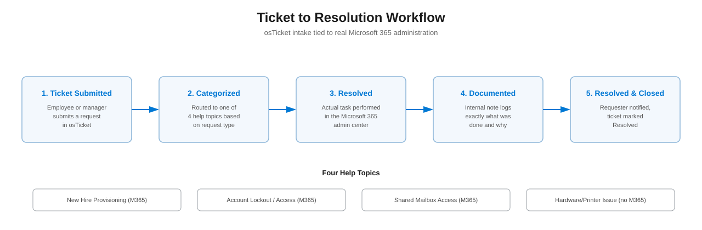
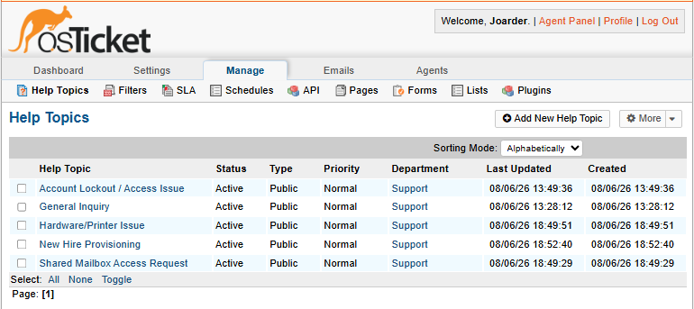
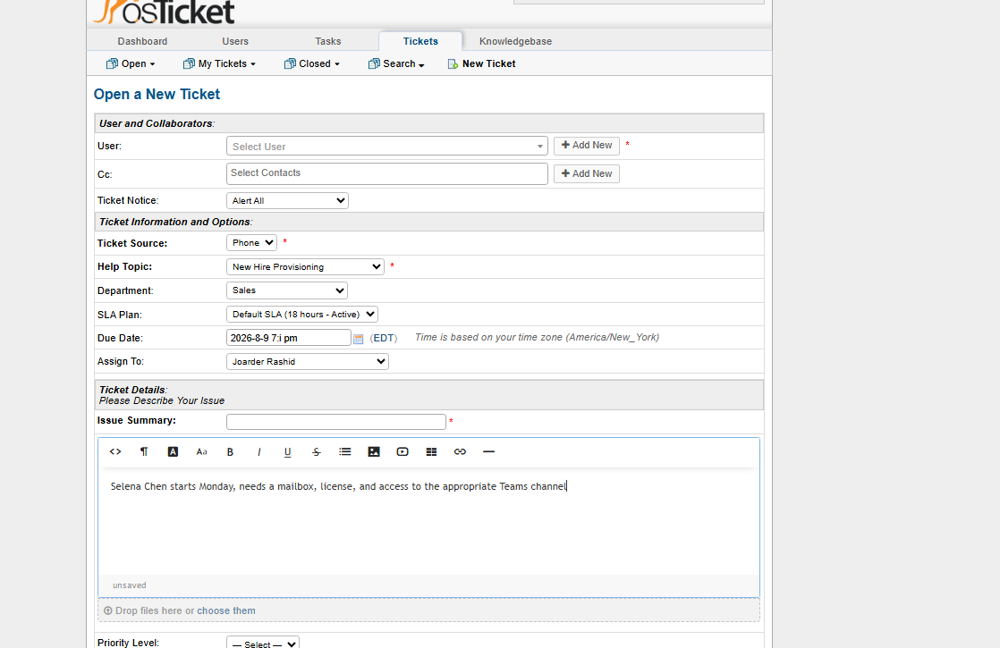
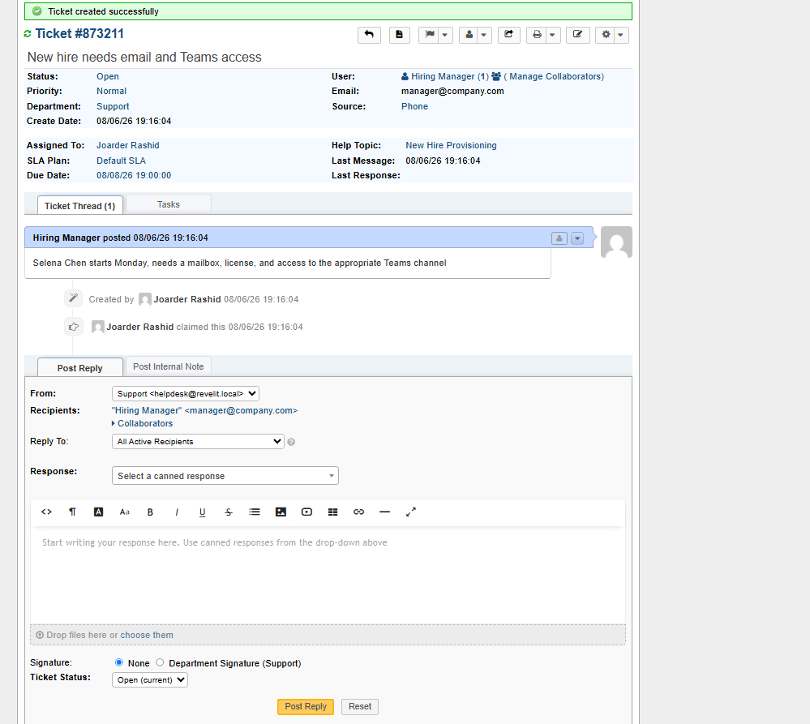
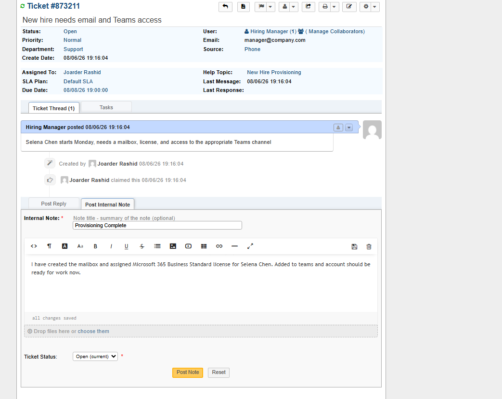
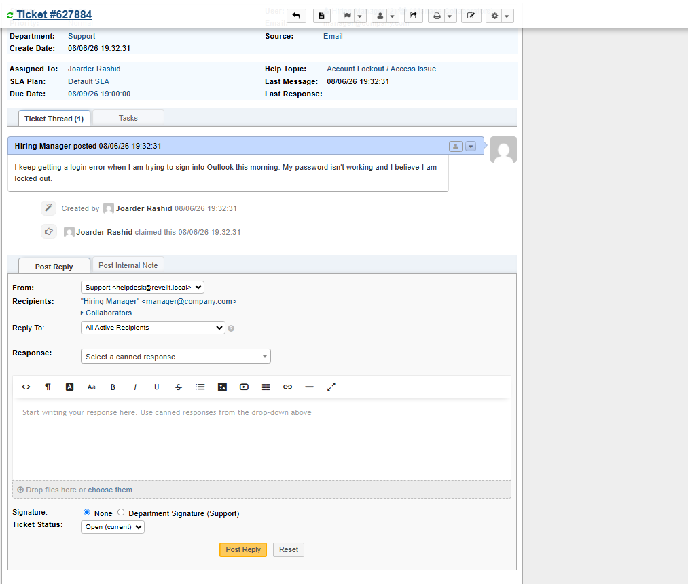
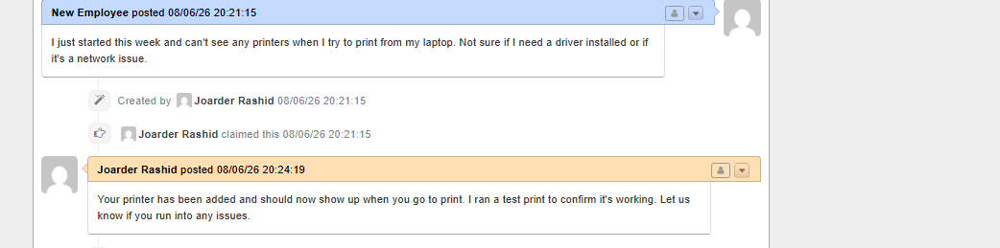

# Ticketing System + Microsoft 365 Administration Lab

## Overview

A small business needs a working intake system for IT requests, and its technicians need to actually resolve those requests, not just log them. This project builds that system: a self-hosted helpdesk (osTicket) that handles the full lifecycle of a support request, intake, categorization, prioritization, resolution, and documentation.

**Scope:** 1 ticketing system, 4 help topic categories, 4 ticket scenarios worked end to end from submission to resolution.

## Skills & Tools

| Category | Tools/Skills |
|---|---|
| Ticketing / ITSM | osTicket, ticket intake, categorization, prioritization, escalation |
| Documentation | Internal notes, resolution replies, business-facing communication |
| Identity & Access | Microsoft 365 admin center, user provisioning, license assignment |
| Access Management | Shared mailbox permissions, password resets, least-privilege access |
| Infrastructure | XAMPP (Apache, MySQL, PHP), local server deployment |

## Environment

- **Ticketing System:** osTicket, self-hosted locally via XAMPP
- **Directory/Admin Platform:** Microsoft 365 Business Standard (trial tenant)
- **Helpdesk Name:** Revel IT Helpdesk

## Workflow

Every request follows the same lifecycle: it comes in, gets categorized into one of four help topics, gets resolved, gets documented with what was done, and gets closed.

## Help Topics

Four categories set up in osTicket to route each incoming request to the right resolution path.

  

## Ticket Scenarios

**1. New Hire Provisioning**

Request: a new hire needs email and Teams access before their start date.

  
  

Resolution: mailbox created, license assigned, Teams access confirmed, and the steps taken logged as an internal note before replying to close the ticket.

  

**2. Account Lockout / Access Issue**

Request: a user can't sign into Outlook and believes their account is locked.

  

Resolution: password reset through the admin center, account unlocked, user required to set a new password at next sign-in, documented and closed.

  

**3. Shared Mailbox Access Request**

Request: the finance team needs a shared mailbox so multiple people can view and respond to invoices and vendor emails.

Resolution: shared mailbox created, access granted to the requesting team member, documented and closed.

  

**4. Hardware/Printer Issue**

Request: a new employee can't see any printers when trying to print.

Resolution: standard hands-on troubleshooting, no M365 admin work required, documented and closed the same way as the other three, proof that the intake and resolution process holds up for tickets that have nothing to do with the directory.

  

## Troubleshooting Notes

- Local MySQL root password caused osTicket's installer to reject a blank password field, then triggered a staff login lockout; resolved by setting a real root password and resetting the admin login directly via the MySQL command line
- Ran out of available Microsoft 365 licenses when creating a new user, since the trial's one license was assigned to the admin account; resolved by unassigning it from the admin and reassigning it to the new user

## Why This Project Matters

When IT requests aren't tracked and followed through consistently, small teams lose track of what employees actually need, and people end up waiting longer than they should for basic things like account access. This project shows what a reliable process looks like: every request gets logged, worked, and closed out with a clear record of what was done.
